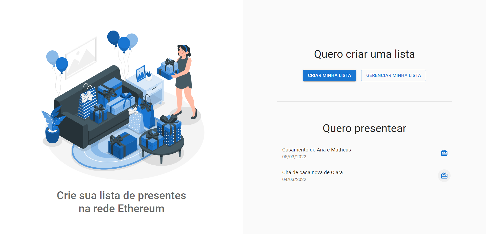
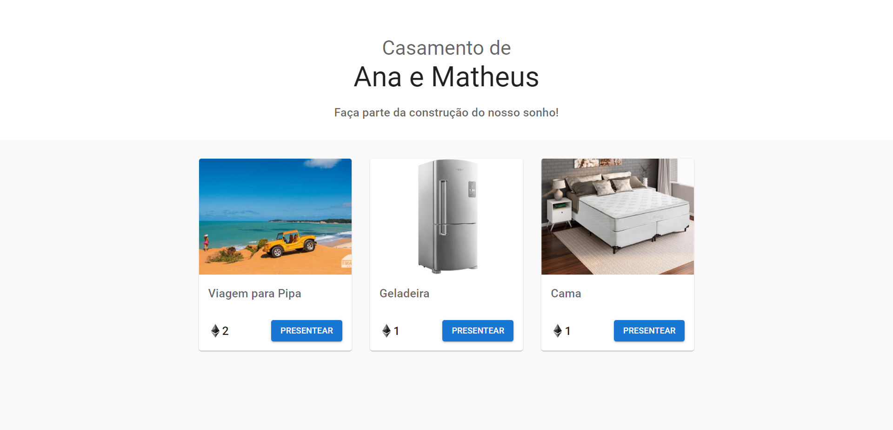
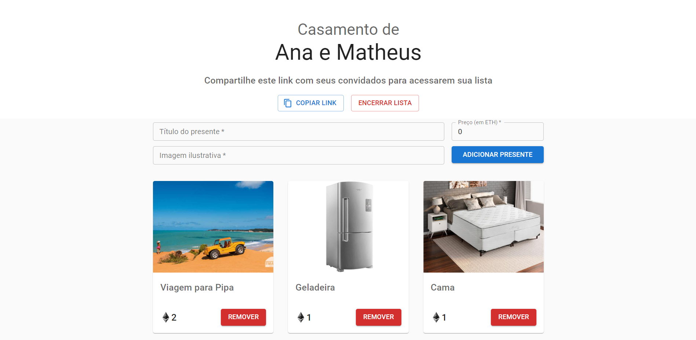

# DApp Lista de Presentes

<!-- <p align="center">
   <a href="#">English (under construction)</a>&nbsp;&nbsp;&nbsp;•&nbsp;&nbsp;
   <a href="https://github.com/lorenatoscano/dapp-project/blob/main/README.md">Português (Brasil)</a>
</p> -->

<p align="center">
  <a href="#sobre">Sobre</a>&nbsp;&nbsp;&nbsp;|&nbsp;&nbsp;&nbsp;
  <a href="#tecnologias-utilizadas">Tecnologias utilizadas</a>&nbsp;&nbsp;&nbsp;|&nbsp;&nbsp;&nbsp;
  <a href="#como-rodar">Como rodar?</a>&nbsp;&nbsp;&nbsp;|&nbsp;&nbsp;&nbsp;
  <a href="#to-do">To do</a>&nbsp;&nbsp;&nbsp;|&nbsp;&nbsp;&nbsp;
  <a href="#licença-e-autores">Licença e Autores</a>
</p>

## Sobre
Projeto desenvolvido para a disciplina de Tópicos Especiais em Internet das Coisas D (Blockchain) do BTI.

O objetivo era desenvolver um DApp completo, incluindo toda a lógica da aplicação, contida no formato de *smart contract* implantado na rede Ethereum Ropsten, e o front-end centralizado que se comunica com um nó Ethereum através da biblioteca web3.js.

Nós implementamos um gerenciador de **listas de presentes** para eventos especiais (casamento, chá de bebê, chá de casa nova, etc), que se conecta com a MetaMask do usuário, permite que o anfitrião cadastre presentes e os convidados "presenteem" por meio de transações de ETH.


### Acesse o contrato na rede Ropsten:
https://ropsten.etherscan.io/address/0xa170b6baee8c09848d5d6e089966b29e76d42004
### Acesse a demo da aplicação em funcionamento:
https://dapp-project.vercel.app/

Obs: Você deve possuir [MetaMask](https://metamask.io/) instalada e configurada no seu navegador para testar as funcionalidades.

_Tela inicial:_
<p align="center">
  
</p>

_Visão do convidado:_
<p align="center">
  
</p>

_Visão do anfitrião (dono da lista):_
<p align="center">
  
</p>


## Tecnologias utilizadas

Este projeto foi desenvolvido utilizando as seguintes tecnologias:

### 📦 Smart Contract
- [Solidity](https://docs.soliditylang.org/en/v0.7.0/)
- [Remix](https://remix.ethereum.org/)

### 💻 Front-end
- [ReactJS](https://reactjs.org/)
- [Typescript](https://www.typescriptlang.org/)
- [web3.js](https://web3js.readthedocs.io/en/v1.7.0/)
- [MUI](https://mui.com/pt/)

##  Como rodar?
Para rodar o front-end, execute os comandos no seu terminal:

```bash
# Clone o repositório
$ git clone https://github.com/lorenatoscano/dapp-project.git
# Entre no repositório
$ cd dapp-project
# Instale as dependências
$ yarn
# Execute a aplicação
$ yarn start
```

Acesse em seu navegador http://localhost:3000/ para ver o resultado.

## To do
Algumas ideias para melhorar a aplicação:

- Adicionar um indicador de "loading" durante as transações para o contrato.
- Adicionar validação nos campos do formulário.
- Adicionar um tema dark.

Fique livre para sugerir novas melhorias e correções [criando uma issue](https://github.com/lorenatoscano/dapp-project/issues/new) 😉.

## Licença e Autores

Este projeto está sob a licença MIT. Veja o arquivo [LICENSE](https://github.com/lorenatoscano/dapp-project/blob/main/LICENSE) para mais detalhes.

Feito com 💜 por [Lorena Toscano](https://github.com/lorenatoscano) e [João Vitor](https://github.com/joaovdxavier).


[](https://www.linkedin.com/in/lorena-toscano-243432183/)

[](https://www.linkedin.com/in/jo%C3%A3o-vitor-637452160/)


